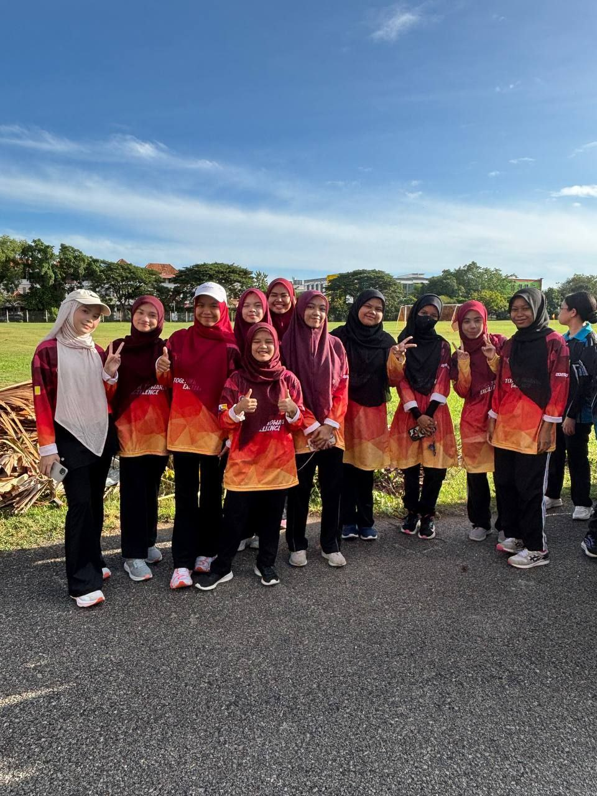
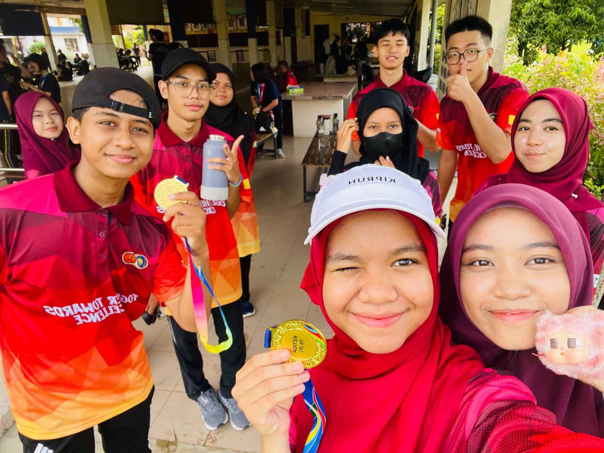

Pada Hari Sabtu 11 Oktober 2025 yang lalu, telah berlangsung satu acara sukan yang penuh meriah iaitu BAYU FUN RUN Peringkat Negeri Pulau Pinang bertempat di SMK Telok Air Tawar. Program ini dianjurkan bagi memupuk amalan gaya hidup sihat dalam kalangan pelajar dan masyarakat di samping mengeratkan hubungan silaturahim antara peserta dari pelbagai latar belakang.
Seawal pagi, para peserta telah berkumpul di SMK TELOK AIR TAWAR untuk proses pendaftaran dan persiapan sebelum acara dimulakan. Pihak penganjur turut menyediakan sarapan pagi kepada para peserta seperti roti dan air kotak sebagai tanda keprihatinan terhadap kebajikan peserta yang hadir awal. Penyediaan sarapan ini membantu memberi tenaga kepada peserta sebelum menyertai acara larian.

1. Muhammad Amirul Haikal bin Mohd Firdaus Tan (UMB) - Peserta 5 (Kategori Lelaki)

2. Muhammad Naufal Thaqif bin Mohamad Mazalan (UPMB) - Peserta 12 (Kategori Lelaki)

3. Nurina Najwa binti Md Rizal (UPMB) - Peserta 3 (Kategori Perempuan)

4. Nur Eriesya Amna binti Abdul Harim (UKMB) - Peserta 10 (Kategori Perempuan)

Acara diteruskan dengan sesi pemanasan badan dan senamrobik bagi memastikan peserta berada dalam keadaan fizikal yang bersedia dan selamat sebelum larian bermula. Acara larian berlangsung dengan lancar dan teratur di bawah pemantauan pihak penganjur serta sukarelawan. Para peserta menunjukkan semangat kesukanan yang tinggi dengan saling memberi sokongan antara satu sama lain sepanjang laluan larian.
Selain itu, pihak penganjur juga telah membuka pameran dan gerai jualan dan booth pameran perancangan dan penumbuhan perniagaan bagi memeriahkan lagi program yang berlangsung bagi memberi pendedahan kepada pelajar dan pengunjung tentang idea keusahawanan serta perancangan perniagaan pada masa hadapan.
Program ini turut menyaksikan penyampaian sijil dan medal kepada para peserta yang berjaya mencatat pencapaian cemerlang. Bagi kategori Sijil Emas dan Medal (15 peserta terawal), pemenang kategori lelaki ialah Muhammad Amirul Haikal bin Mohd Firdaus Tan (UMB) dengan nombor peserta 5 dan Muhammad Naufal Thaqif bin Mohamad Mazalan (UPMB) dengan nombor peserta 12. Manakala bagi kategori perempuan, pemenang ialah Nurina Najwa binti Md Rizal (UPMB) dengan nombor peserta 3 dan Nur Eriesya Amna binti Abdul Harim (UKMB) dengan nombor peserta 10.Penyampaian anugerah ini merupakan tanda penghargaan terhadap usaha, disiplin dan semangat juang para peserta sepanjang acara berlangsung.
Secara keseluruhannya, BAYU FUN RUN Peringkat Negeri Pulau Pinang telah berlangsung dengan jayanya dan mencapai objektif penganjurannya. Program ini bukan sahaja memberi manfaat dari segi kesihatan fizikal, malah berjaya menyemai nilai-nilai murni seperti kerjasama, disiplin dan semangat kesukanan dalam kalangan peserta. Diharapkan program seumpama ini dapat diteruskan pada masa akan datang demi melahirkan masyarakat yang sihat, aktif dan berdaya saing.

