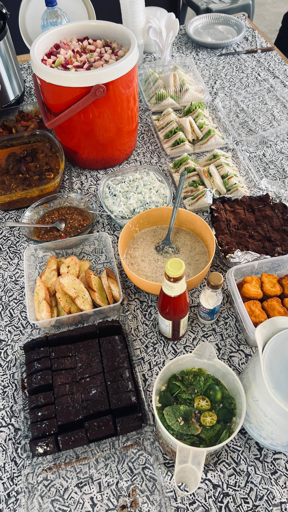
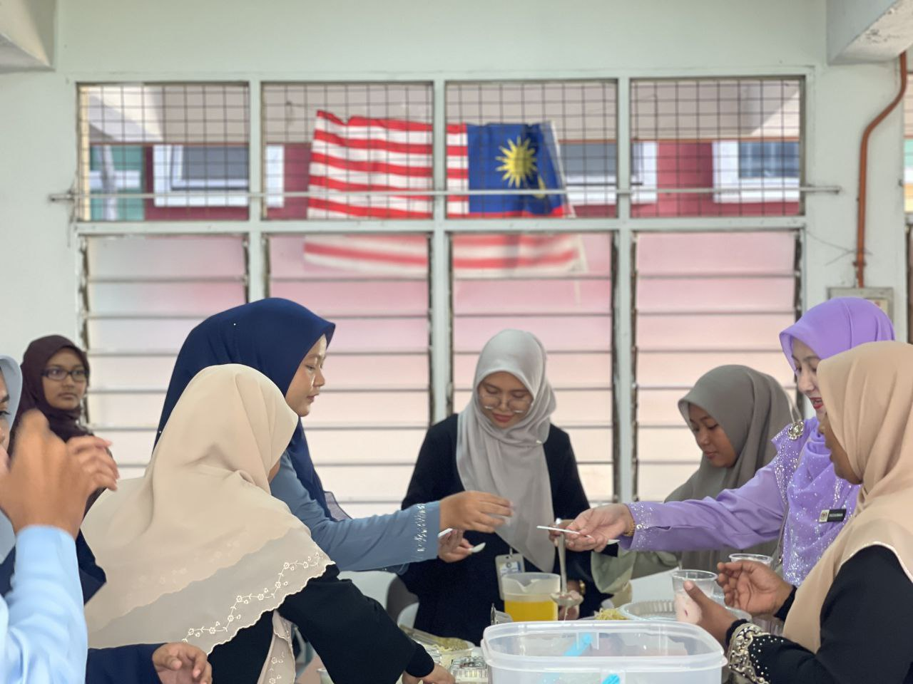
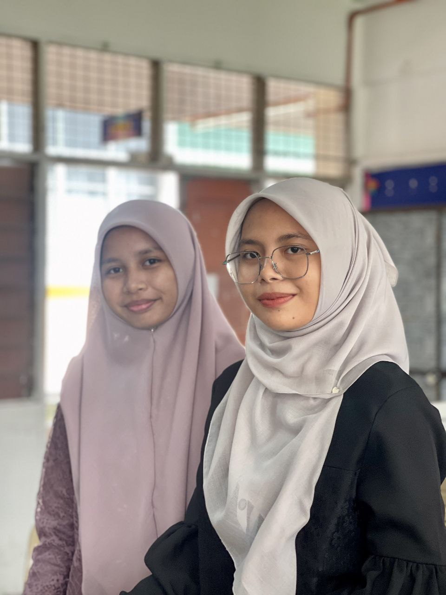
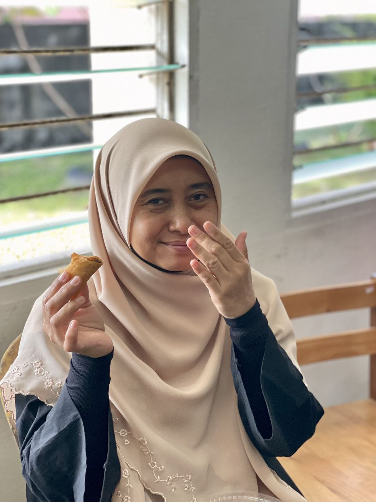

---

title: 'Jamuan Akhir Tahun 2025'
description: 'NextBoss pertandingan ini telah diusahakan beberapa pelajar tingkatan enam dan telah mendapat tempat ke-5 !!!!'
pubDate: 'Dec 19 2025'
heroImage: '../../assets/jamuan2025/thumbnail.png'
---

### Penulis : Amilia Farzana
##### Sumber  : Nashifa, Sumaiyah, Aisya, Fawwaz

Pada Hari Jumaat 19 Disember 2025 yang lalu, telah berlangsung satu Jamuan Akhir Tahun secara tertutup peringkat PTE SMK PENANTI yang dianjurkan dengan jayanya oleh pihak pentadbir bersama kerjasama para pelajar semester 1 dan semester 3 . Program ini diadakan sebagai tanda penghargaan terhadap komitmen dan usaha semua pihak sepanjang 
pelaksanaan PTE serta sebagai penutup kepada 
aktiviti-aktiviti yang telah dijalankan sepanjang tahun.
Tujuan utama penganjuran jamuan ini adalah untuk mengeratkan hubungan silaturahim antara pelajar dan guru di samping mewujudkan suasana harmoni dalam kalangan warga sekolah. Program ini juga memberi peluang kepada para pelajar untuk merehatkan minda setelah melalui pelbagai cabaran akademik dan aktiviti sepanjang tahun persekolahan.
Majlis jamuan ini dimeriahkan dengan pelbagai juadah makanan yang disediakan hasil sumbangan dan kerjasama semua pihak.

Hidangan yang disajikan bukan sahaja menyelerakan, malah mencerminkan semangat kebersamaan dan toleransi dalam kalangan pelajar & guru. 
Suasana jamuan berlangsung dalam keadaan yang ceria, santai dan penuh kemesraan.

Selain menikmati hidangan, para pelajar turut mengambil kesempatan untuk berinteraksi, berbual mesra serta bergambar bersama sebagai kenangan. Aktiviti-aktiviti santai ini secara tidak langsung dapat mengeratkan lagi hubungan sesama rakan dan guru, sekali gus mewujudkan persekitaran sekolah yang lebih positif dan kondusif.
Majlis ini juga menjadi platform untuk para pelajar menghargai jasa dan pengorbanan guru-guru yang tidak jemu membimbing dan memberi tunjuk ajar sepanjang pelaksanaan PTE. Kehadiran dan sokongan para guru jelas menunjukkan keprihatinan mereka terhadap kebajikan dan kesejahteraan pelajar.
Secara keseluruhannya, jamuan akhir tahun sempena PTE ini telah berlangsung dengan lancar dan berjaya. Program ini bukan sahaja meninggalkan kenangan manis kepada semua pihak yang terlibat, malah diharapkan dapat menjadi pemangkin semangat untuk menghadapi sesi pembelajaran yang akan datang dengan lebih berkeyakinan dan positif.

> Jamuan akhir tahun mengeratkan hubungan, memperkukuh silaturahim.
> — Cikgu Arfa

> Jamuan akhir tahun ini simple 
> tetapi bermakna serta meninggalkan 
> kenangan indah & yang pasti perut semua orang kenyang.
> — Nurina 

> Dengan adanya dengan jamuan ini,
> kami dapat rehatkan otak yang sudah membeku.
> — Amiii
