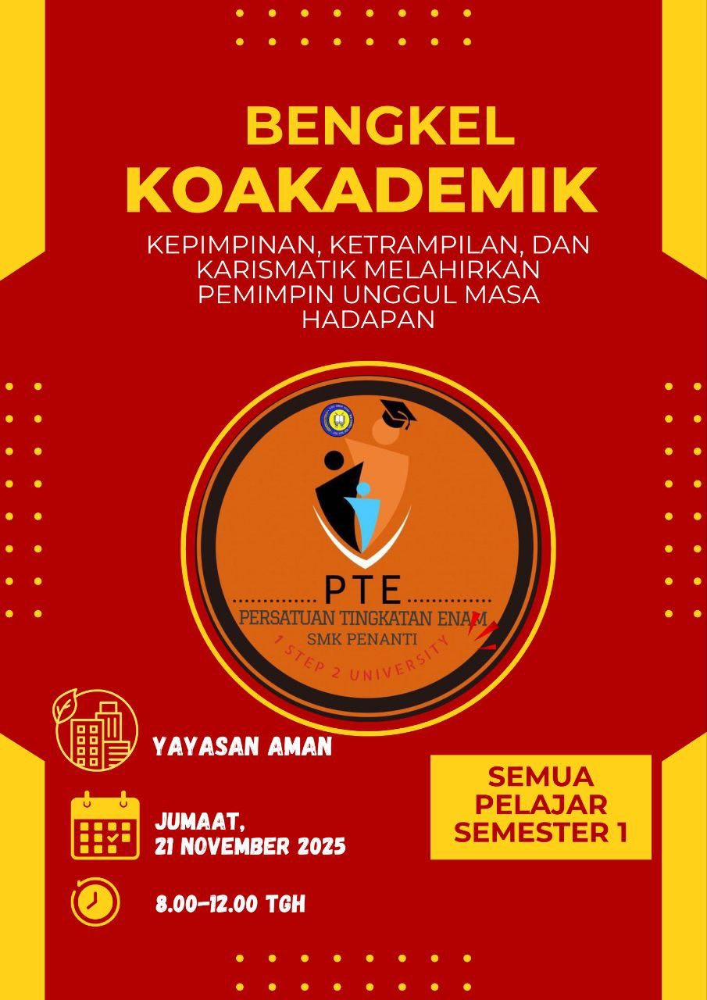

Cikgu Zalilah, seorang bekas guru di SMK Penanti, telah kembali ke sekolah tersebut untuk memberikan motivasi kepada pelajar Tingkatan Enam Semester 1.

Pada slot pertama, Cikgu Zalilah berkongsi kisah kehidupannya semasa kecil. Beliau menceritakan perjalanan hidupnya mulai dari peringkat STPM sehingga ke universiti untuk menjadi seorang guru. Beliau turut menyampaikan kata-kata hikmah, “Usaha tak pernah mengkhianati hasil,” sambil menekankan betapa pentingnya usaha gigih dalam mencapai cita-cita. Impiannya untuk menjadi guru kaunseling mendorongnya mengulang kertas STPM demi merealisasikan hasrat tersebut.

> "Saya termotivasi dan ingin berubah menjadi pelajar yang rajin belajar dan tidak mudah menyerah."  ⸻ Ikram

Selepas rehat, beliau menyambung sesi dengan menceritakan pengalaman anaknya yang mengambil aliran sains walaupun tidak meminati bidang tersebut. Pada mulanya, Cikgu Zalilah menyarankan anaknya meneruskan pengajian dalam aliran sains, namun akhirnya menyedari bahawa anaknya tidak berkemampuan untuk melaluinya. Lantas, beliau mengambil keputusan untuk membiarkan anaknya mengikut jalan yang sesuai dengan minat dan kebolehannya.

> "Saya nak lebih aktif."  ⸻ Akma

Seterusnya, beliau menjalankan satu aktiviti dalam program tersebut untuk menilai kreativiti pelajar. Permainan tersebut dinamakan “Permainan Separuh Bulatan” yang terbahagi kepada empat bahagian.

> "Cikgu itu baguih, memberi ilmu pengetahuan yang boek." ⸻ Fawaz

