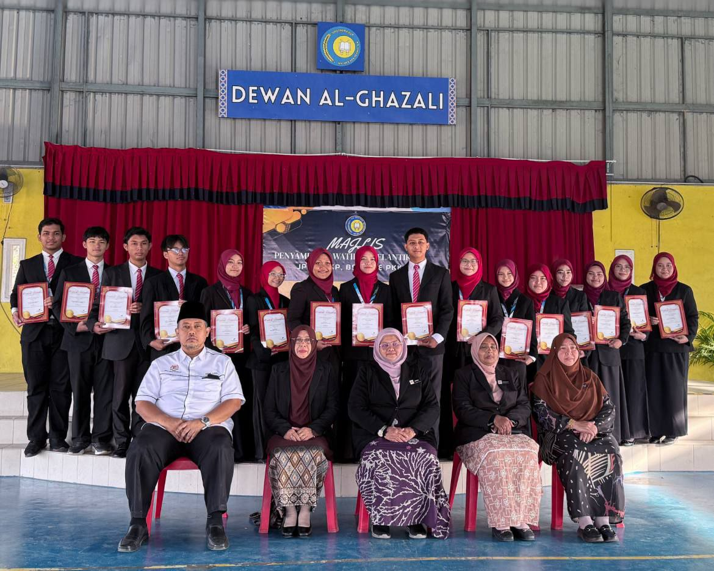
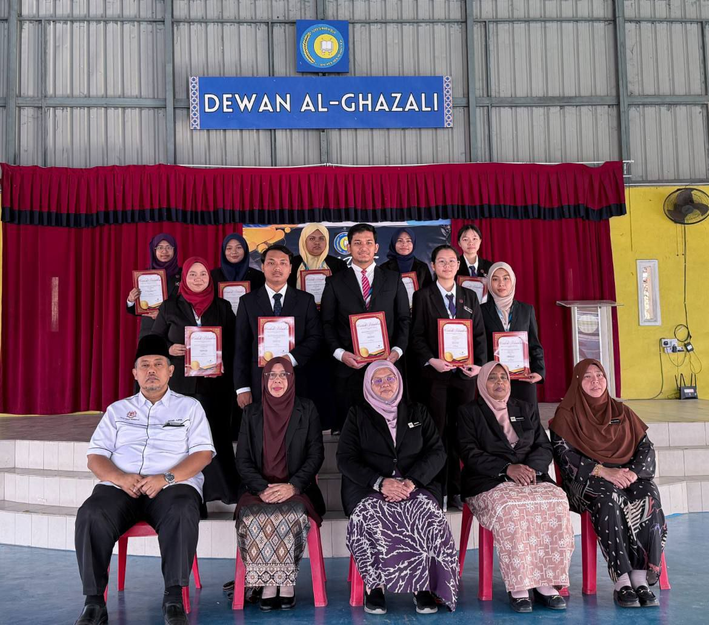
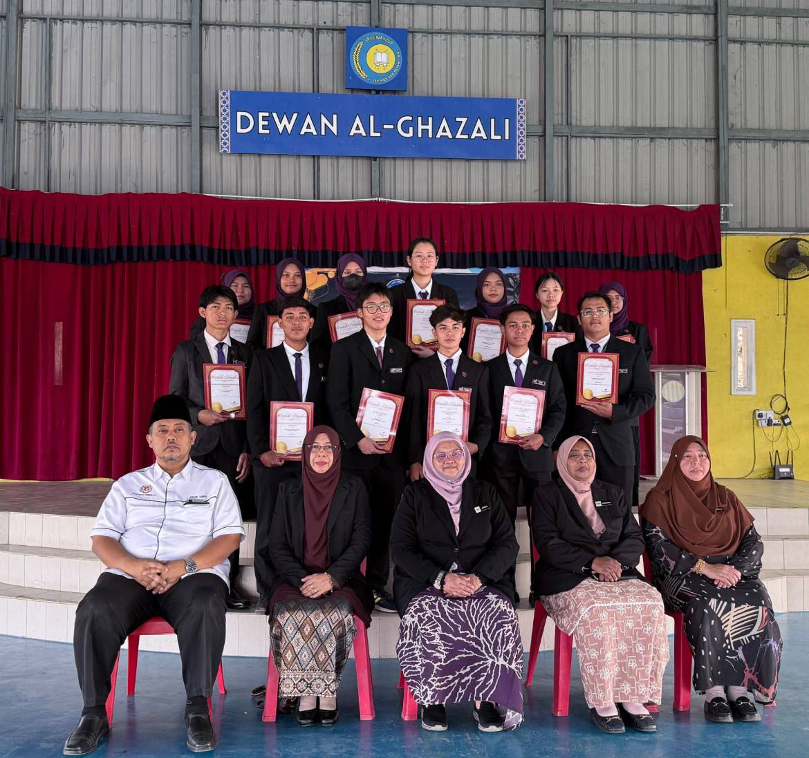
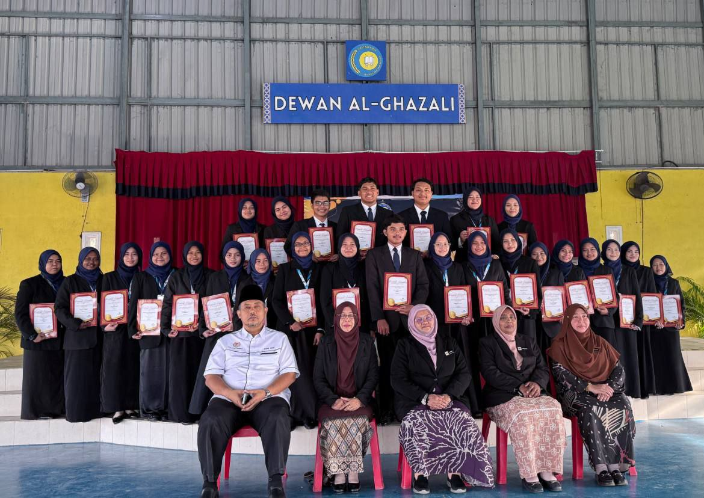
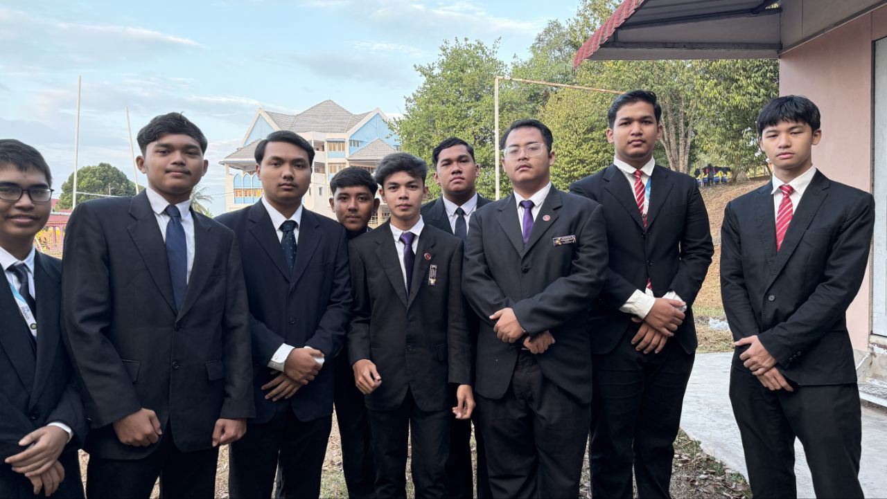
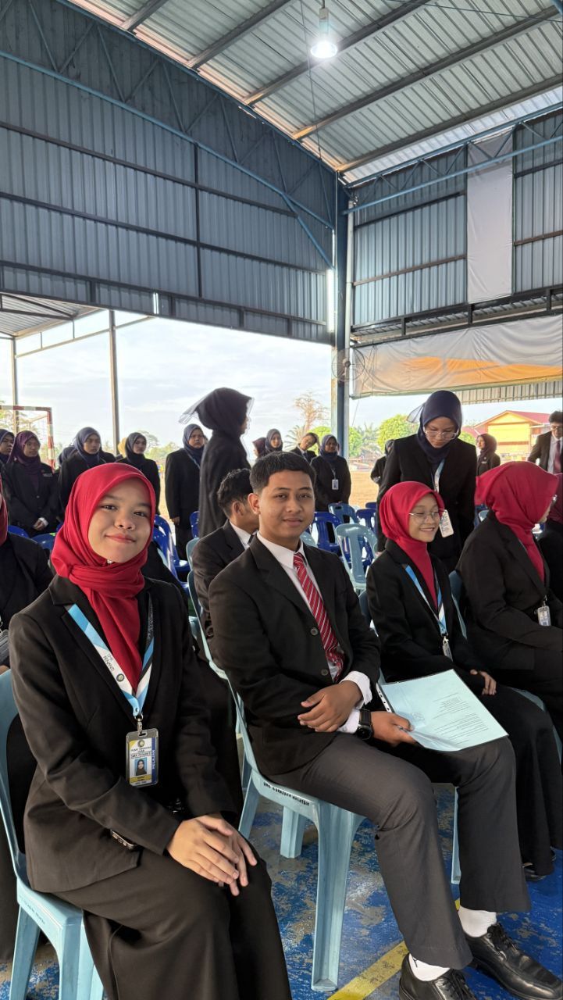

---

title: 'Majlis Watikah Pelantikan JPTE, BKP, BSI, Koordinator Kelas dan Penolong Koordinator Kelas Tahun 2025/26 '
description: 'NextBoss pertandingan ini telah diusahakan beberapa pelajar tingkatan enam dan telah mendapat tempat ke-5 !!!!'
pubDate: 'Dec 19 2025'
heroImage: '../../assets/Watikah/photo_2026-02-10_16-43-19.jpg'
---

Majlis Watikah Pelantikan JPTE,BKP,BSI,Ketua Koordinator Ketua Dan Penolong Ketua Koordinator telah berlangsung dengan jayanya pada Khamis, 5 Februari 2026. Majlis ini dianjurkan bertujuan untuk melantik dan memberi pengiktirafan 
rasmi kepada para pelajar yang telah dipilih untuk memegang jawatan kepimpinan serta tanggungjawab tertentu di peringkat sekolah.

Majlis ini telah dimulakan dengan bacaan doa oleh saudara Adam Faiz Bin Norazian bagi memohon keberkatan dan kelancaran sepanjang majlis berlangsung. Seterusnya, ucapan alu-aluan telah 
disampaikan oleh Penolong Kanan Tingkatan 6,Pn.Zubaidah Binti Ali bagi menjelaskan tujuan pelaksanaan majlis watikah serta kepentingan peranan yang bakal dipikul oleh para penerima watikah pelantikan.
Seterusnya,ucapan perasmian telah disampaikan oleh Penolong Kanan Pentadbiran,Pn.Amirah Binti Abu Bakar mewakili Tuan Pengetua yang
tidak dapat menghadirkan diri atas faktor peribadi. 

Acara kemuncak majlis ialah penyampaian watikah pelantikan kepada para pelajar yang terlibat. Penyampaian ini melambangkan kepercayaan dan amanah yang diberikan 
kepada mereka untuk melaksanakan tugas dengan penuh dedikasi, berdisiplin dan bertanggungjawab. 
Para penerima watikah kelihatan bersemangat dan beriltizam untuk menjalankan tanggungjawab yang telah diamanahkan sebaik mungkin.

Majlis watikah ini bukan sahaja bertujuan melantik barisan kepimpinan baharu, malah turut memberi pendedahan awal kepada pelajar tentang 
nilai kepimpinan, kerjasama dan etika dalam melaksanakan tugas. Diharapkan melalui program ini, para pelajar dapat menjadi contoh 
teladan yang baik serta membantu dalam melancarkan pelbagai aktiviti yang dirancang pada masa akan datang.

Secara keseluruhannya, Program Watikah Pelantikan JPTE,BKP,BSI,Ketua Koordinator Kelas Dan Penolong Ketua Koordinator Kelas ini telah berjalan dengan lancar dan teratur. Setinggi-tinggi penghargaan diucapkan kepada 
semua pihak yang terlibat secara langsung mahupun tidak langsung dalam menjayakan program ini. 
Semoga para penerima watikah dapat menjalankan amanah yang diberikan dengan penuh komitmen dan integriti.

