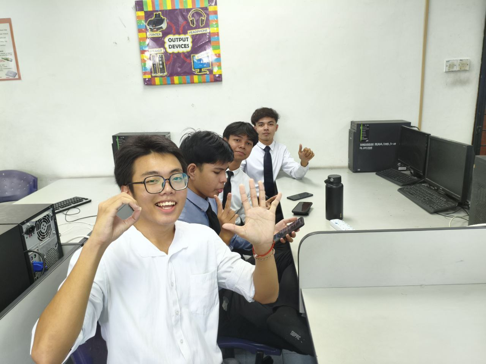

##### Ditulis oleh Amelia. 

Pada 12 Disember 2025 (Jumaat), telah berlangsung satu pertandingan Mobile Legends: Bang Bang (MLBB) sempena Majlis Penutupan ICTTHON Peringkat Sekolah Menengah Kebangsaan Penanti yang bertempat di Dewan Al-Ghazali. Program ini dianjurkan bagi memberi pendedahan kepada para pelajar terhadap dunia e-sukan di samping menggalakkan penggunaan teknologi digital secara positif dan beretika.
Seawal program bermula, suasana di Dewan Al-Ghazali amat meriah dengan kehadiran para pelajar dan guru yang hadir bagi menyaksikan pertandingan tersebut. 

Pertandingan MLBB ini mendapat sambutan yang sangat menggalakkan apabila disertai oleh beberapa pasukan pelajar yang menunjukkan semangat berpasukan dan daya saing yang tinggi.
Pertandingan ini bukan sahaja menguji kemahiran bermain permainan digital, 
malah menitikberatkan aspek kerjasama pasukan, strategi, komunikasi dan kepimpinan dalam kalangan peserta. 

Setiap pasukan memperlihatkan perancangan permainan yang tersusun serta semangat kesukanan yang tinggi sepanjang pertandingan berlangsung.
Selain itu, pertandingan MLBB ini juga menjadi platform kepada para pelajar untuk memanfaatkan minat terhadap permainan digital secara berfaedah. 

Program ini secara tidak langsung memberi kesedaran bahawa e-sukan mampu menjadi medium pembelajaran yang positif sekiranya dikawal dan dimanfaatkan dengan betul.
Majlis penutupan ICTTHON ini turut dimeriahkan dengan sorakan dan sokongan padu daripada para penonton, sekali gus menjadikan suasana pertandingan lebih hidup dan menyeronokkan. Kehadiran guru-guru sebagai pemantau juga memastikan pertandingan berjalan dengan lancar dan berdisiplin.
Secara keseluruhannya, pertandingan MLBB sempena Majlis Penutupan ICTTHON SMK Penanti telah berlangsung dengan jayanya dan mencapai objektif penganjurannya. 

Program ini bukan sahaja memberi hiburan kepada para pelajar, malah berjaya menyemai minat terhadap bidang teknologi maklumat dan komunikasi serta e-sukan dalam kalangan pelajar. 
Diharapkan program seumpama ini dapat diteruskan pada masa akan daang sebagai salah satu platform pembelajaran yang interaktif dan relevan dengan perkembangan teknologi semasa.
